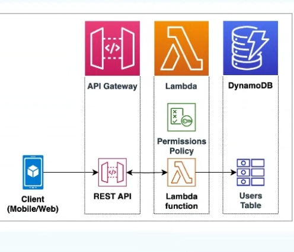

# Resume Challenge

This project aims to build and deploy a serverless API using AWS, integrated with GitHub Actions for CI/CD. The primary goal is to construct an API that can serve resume data in JSON format using AWS services such as API Gateway, Lambda functions, and DynamoDB.

## Table of Contents


- [project architecture](#image ) 
- [Prerequisites](#prerequisites)
- [AWS Resources](#aws-resources)
- [Lambda Function](#lambda-function)
- [CloudFormation Template](#cloudformation-template)
- [GitHub Actions](#github-actions)
  - [Static Website Deployment](#static-website-deployment)
  - [API and Lambda Functions Deployment](#api-and-lambda-functions-deployment)
- [Secrets Management](#secrets-management)
- [Deployment](#deployment)
  - [Static Website](#static-website)
  - [API and Lambda Functions](#api-and-lambda-functions)
- [Testing the API](#testing-the-api)
- [Contributing](#contributing)
- [License](#license)

## Project Structure
## Project architecture
- 
- 


## Prerequisites

- AWS account
- AWS CLI configured
- GitHub account
- GitHub repository with the following secrets:
  - `AWS_ACCESS_KEY_ID`
  - `AWS_SECRET_ACCESS_KEY`
  - `AWS_REGION`
  - `S3_BUCKET`
  - `CLOUDFRONT_DISTRIBUTION_ID`
- Python 3.8

## AWS Resources

1. **DynamoDB**: Stores resume data.
2. **Lambda**: Handles API requests.
3. **API Gateway**: Provides REST API endpoints.
4. **S3**: Hosts the static website (index.html, CSS, JS).
5. **CloudFront**: Distributes the static website.

## Lambda Function

The Lambda function handles CRUD operations for resume data in DynamoDB.

## CloudFormation Template

Defines the DynamoDB table, Lambda function, and API Gateway in `lambda.yaml`.

```yaml
AWSTemplateFormatVersion: '2010-09-09'
Transform: 'AWS::Serverless-2016-10-31'
Resources:
  MyResumeTable:
    Type: 'AWS::DynamoDB::Table'
    Properties:
      TableName: 'MyResume'
      AttributeDefinitions:
        - AttributeName: 'ID'
          AttributeType: 'S'
      KeySchema:
        - AttributeName: 'ID'
          KeyType: 'HASH'
      ProvisionedThroughput:
        ReadCapacityUnits: 5
        WriteCapacityUnits: 5

  ResumeFunction:
    Type: 'AWS::Serverless::Function'
    Properties:
      Handler: resume_handler.lambda_handler
      Runtime: python3.8
      CodeUri: lambda/
      MemorySize: 128
      Timeout: 10
      Policies:
        - DynamoDBCrudPolicy:
            TableName: 'MyResume'
      Events:
        Api:
          Type: Api
          Properties:
            Path: /resume/{id}
            Method: any
            
## Githb actions 

